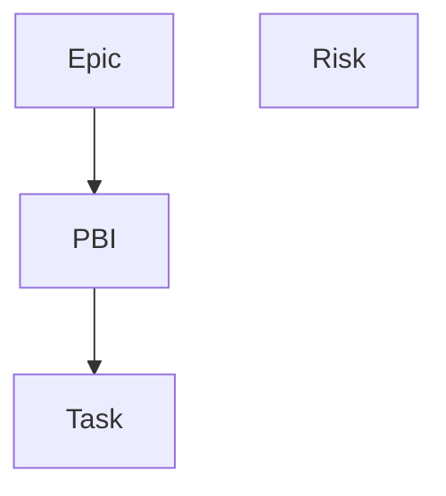

# Issue Template の使い分け

4 つの Issue Template は、作業の大きさと目的で使い分ける。

## テンプレート一覧

| テンプレート | 使う場面 | 主に作成する人 | 親子関係 |
| --- | --- | --- | --- |
| Epic | 複数 Sprint にまたがる大きな作業を整理したいとき | PO | 親。複数の PBI を持つ |
| PBI（Product Backlog Item） | Epic を 1 Sprint で実装できる大きさに分割したいとき | PO、Developers（Dev Lead） | Epic の子。必要に応じて複数の Task を持つ |
| Task | PBI を進めるための具体的な作業を分けたいとき | Developers | PBI の子 |
| Risk | セキュリティを含むプロジェクトのリスクを管理したいとき | チーム全員 | 独立。Epic / PBI / Task の親子関係に含まれない |

## 親子関係

- Epic は大きなゴールを表す
- PBI は Epic を 1 Sprint で完了できる単位に分けたもの
- Task は PBI を実装するための作業メモやサブタスク
- Risk はセキュリティ向けテンプレートも兼ねる、独立したリスク管理用 Issue

## 迷ったときの選び方

- 複数 Sprint にまたがるなら Epic
- 1 Sprint で完了させたい成果なら PBI
- 実装や調査の作業を分けたいなら Task
- セキュリティを含むリスク、懸念、対策管理なら Risk

## 使い方の流れ

### 作業の分割（Epic → PBI → Task）

1. まず PO が Epic を作成する
2. Epic を元に、PO と Developers（Dev Lead）が PBI に分割する
3. Sprint で着手する PBI に対して、必要なら Developers が Task を追加する

### リスク管理（Risk）

- セキュリティを含むリスクを見つけたら、上記の作業階層とは別にいつでも Risk を作成する
- Risk は Epic / PBI / Task の流れに依存しない独立した Issue として管理する
